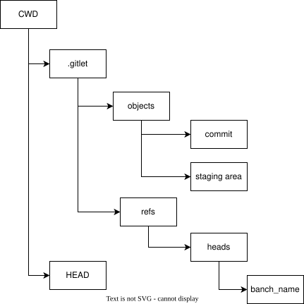

# Gitlet Design Document

**Anh Ha**:

## Classes and Data Structures

### Main
This is the entry point to our program. It takes in arguments from the command line and based on 
the command (the first element of the args array) calls the corresponding command in 
Repository which will actually execute the logic of the command. It also validates the 
arguments based on the command to ensure that enough arguments were passed in.

#### Fields
This class has no fields and hence no associated state: it simply validates arguments and defers 
the execution to the Repository class.

### Commit
This class represents a commit that will be stored in a file. 
Commit save in .gitlet/objects/ folder, same real git, two prefix character of commit sha-1 is folder, remain sha-1 character of 
commit is store commit file. 

#### Fields

1. String message: message of this commit
2. Date timestamp: timestamp of this commit
3. String firstParentId: sha-1 id of first parent commit 
4. String secondParentId: sha-1 id of second parent commit, use in case merge feature
5. TreeMap<String, String> fileNameToBlob: Map from file name to blob sha-1 id of files

### StagingArea
This class represents a StagingArea that will be stored in a file. StagingArea contain add files and remove files 
and save in .gitlet/index file 

#### Fields

1. TreeMap<String, String> addFiles: file name and blob sha-1 id of file 
2. TreeSet<String> removeFiles: list remove file name 

### Repository

This is where the main logic of our program will live. This file will handle all of 
the actual gitlet commands by reading/writing from/to the correct file, setting up 
persistence, and additional error checking.

It will also be responsible for setting up all persistence within gitlet. This includes 
creating the .gitlet folder as well as the folder and file where we store all Commit objects and StagingArea.

This class defers all Commit and StagingArea specific logic: for example, instead of 
having the Repository class handle Commit serialization and deserialization, we have 
the Commit class contain the logic for that.

#### Fields
1. static final File CWD = new File(System.getProperty("user.dir")) The Current Working 
Directory. Since it has the package-private access modifier (i.e. no access modifier), 
other classes in the package may use this field. It is useful for the other File 
objects we need to use.

2. static final File GITLETS_FOLDER = Utils.join(CWD, ".gitlet") The hidden .gitlet 
directory. This is where all of the state of the Repository will be stored, 
including additional things like the Commit objects and StagingArea. It is also 
package private as other classes will use it to store their state.

These fields are both static since we don’t actually instantiate a Repository object: 
we simply use it to house functions. If we had additional non-static state (like the Commit class), 
we’d need to serialize it and save it to a file.

### Utils
This class contains helpful utility methods to read/write objects or String 
contents from/to files, as well as reporting errors when they occur.

This is a staff-provided and PNH written class, so we leave the actual implementation 
as magic and simply read the helpful javadoc comments above each method to give us 
an idea of whether or not it’ll be useful for us.

#### Fields
Only some private fields to aid in the magic.

###

## Algorithms

## Persistence
The directory structure looks like this:

The Commit class will handle the serialization of Commit objects. It has two methods 
that are useful for this:

1. public static Commit fromFile(String commitId) - Given the id of a Commit object, 
it retrieves the serialized data from the COMMIT_FOLDER (which is .gitlet.objects.commit) and 
uses the Utils.readObject method to convert it to an instance of Commit.
2. public void saveCommit() - Serializes this commit object to the COMMIT_FOLDER in a file 
whose id is the same as the id of the Commit object 

Same for StagingArea class 

The HEAD file store in .gitlet place in Repository class 

